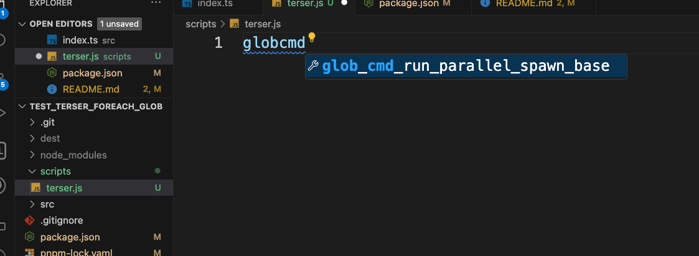
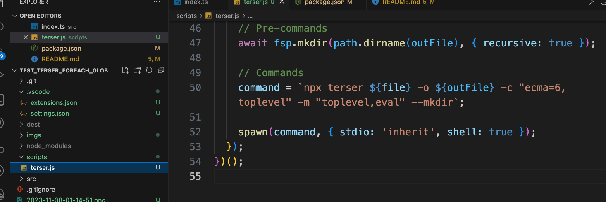

# tutorial-running-terser-npm-glob-programmatic

This repo does demonstrate the usage of:

- `npm-run-all` in setting up tasks
  - Running multiple tasks, cross platform, with great productivity
- `foreach-cli`
  - for running same command cross multiple files matched by a glob
    - we used that with `terser`
    - We often would need that in commands that support only a one to one file processing-outputting
- Running terser and one to one file commands, `programmatically` and how to be productive at it
  - Set a snippet for a great base that you can re-use any time for any need.

> Check [package.json](package.json)

## Setup

```bash
pnpm install
```

## Executing using `foreach-cli`

```bash
npm run build
```

- Will run `typescript` first
- `foreach-cli` next

## Executing the `programmatic` build

```bash
npm run build:prog
```

- Will execute the `typescript` build task first
- And then run the [nodejs script](scripts/terser.js)
  - The script does create the directories first. Before running `terser` on it. Terser does require this.
  - The script is intended for you to take as a snippet for productivity
    - It does support parsing file path, give you `reldir`, and so basically all is expanded in front of us to move fast with such tasks.
    - Being productive is about accessing things in a second. And super fast. `Snippets` give us this power.

Snippet

```js
/**
 * npm install fast-glob
 */
const { spawn } = require('child_process');
const fastGlob = require('fast-glob');
const path = require('path');
const fs = require('fs');
const fsp = fs.promises;

const rootDir = path.resolve(__dirname, '..');

/**
 * Relative path to root
 */
function root(relPath) {
  return path.resolve(rootDir, relPath);
}

/**
 * Resolve alias
 */
function r(..._path) {
  return path.resolve(..._path);
}

/**
 * File selection
 */
(async () => {
  const glob = './dest/js/**/*.js';
  // const globIgnore = '';

  const files = await fastGlob(root(glob));

  files.forEach(async (file) => {
    // Note: file is absolute (fastGlob default)
    console.log(`file: ${file}`);
    const fileParse = path.parse(file);
    const { name, ext, dir } = fileParse;
    const reldir = path.dirname(path.relative(root('dest/js'), file));

    // console.log(`reldir: ${reldir}`);

    const outFile = root(`dest/minified/${reldir}/${name}.min${ext}`);
    console.log(`outFile: ${outFile}`);

    // Pre-commands
    await fsp.mkdir(path.dirname(outFile), { recursive: true });

    // Commands
    command = `npx terser ${file} -o ${outFile} -c "ecma=6,toplevel" -m "toplevel,eval" --mkdir`;

    spawn(command, { stdio: 'inherit', shell: true });
  });
})();
```



And it expands



## foreach-cli, reldir issue

- https://github.com/danielkalen/foreach-cli/issues/10
- And fix i wrote: https://github.com/danielkalen/foreach-cli/pull/11
  - The PR does explain and show a good example of `no pure tests`. A mistake that many may fall on.

## Articles i wrote - related -

- [Npm scripts - running commands with globs expansion for each file](https://medium.com/@allalmohamedlamine/npm-scripts-running-commands-with-globs-expansion-for-each-file-46efc17b80bb)